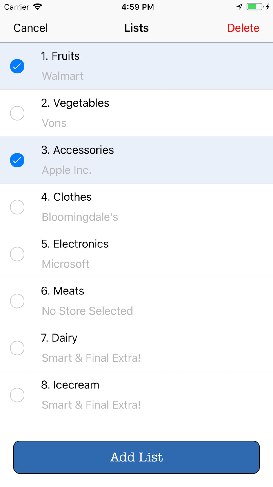
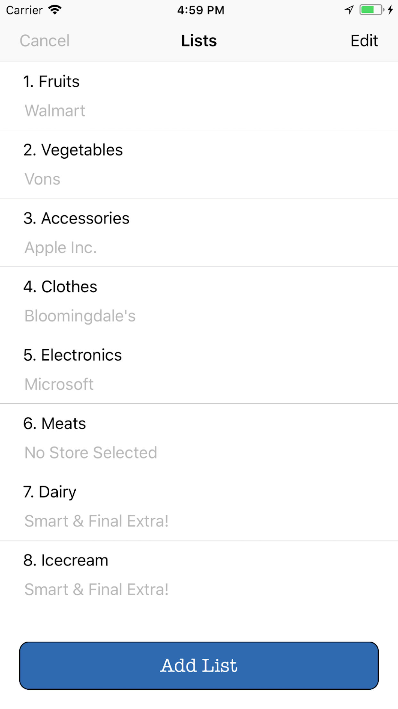
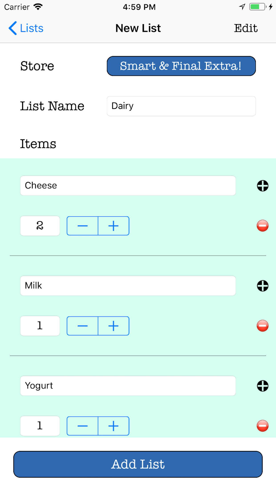
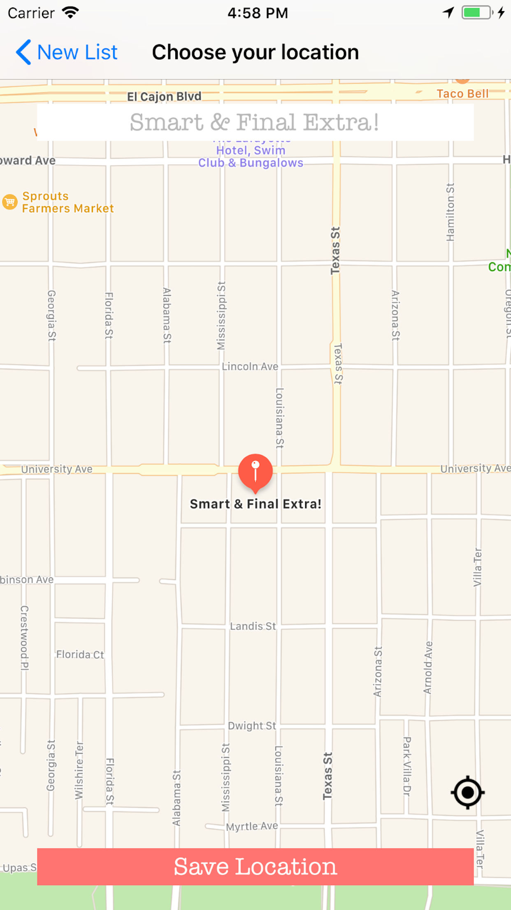
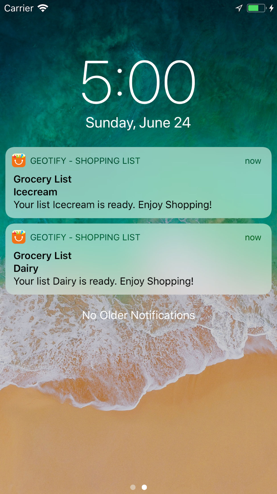
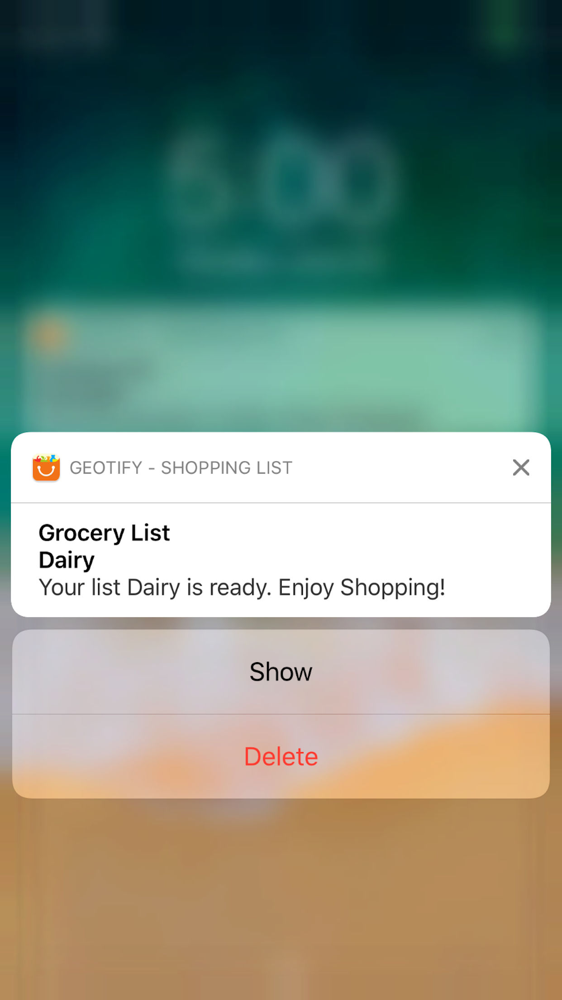

# Geotify

Creating a grocery list and locating the store made easy -  An ingenious solution to the sticky notes and overwhelming lists of items.
Shopping list app: Comes with an option to add desired store  with multiple lists without the need of memorizing which items to shop from which store. Also, the notifications will handle the display of the respective list when you are in the vicinity of the store and you will have your list handy and ready before you even step in the store.

The handy features of Geotify includes: 

1. Add multiple shopping lists and map them with the location of your favorite stores. 

2. Receive shopping list notification ready at the doorstep of your favorite store. Shopping simplified !! 

3. 1-click editing of any previously added lists. 

4. Use Geotify not just for shopping but for any other reminders that you need when you reach a particular location. 

5. Until and unless you delete the list, you will always get the notification for your favorite shop, and the list will be always ready to go and making sure you don't miss out on something important.

Disclaimer: Continued use of GPS running in the background can dramatically decrease battery life.

# Screenshots

 

 

 

 

 

 

# Requirements

- Xcode 9
- iOS 11
